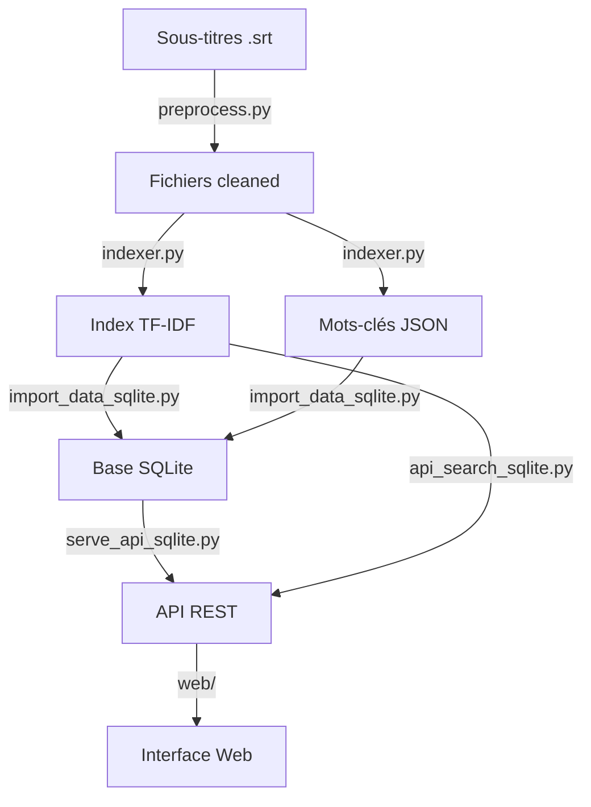

# 🎬 Projet SAE501 - Recherche et Recommandation de Séries TV

## 📖 Vue d'ensemble

Moteur de recherche et système de recommandation pour 128 séries TV (250 fichiers VF/VO), utilisant le traitement du langage naturel (NLP), l'indexation TF-IDF, le filtrage collaboratif, et une base de données SQLite.

### ✅ Objectif SAE rempli

**Exigence** : "crash avion ile" doit retourner **Lost** dans le top 3.

**Résultat** : ✅ **Lost_VF en position #1 (score: 1.125)**

## 🎯 Fonctionnalités

### 1. Recherche TF-IDF + Mots-clés
- **Indexation** : 50 000 features TF-IDF (unigrammes + bigrammes)
- **Extraction** : 200 mots-clés par série (scoring spécificité × fréquence)
- **Boost** : +0.5 pour match exact, +0.2 pour match partiel
- **Normalisation** : Suppression accents, traitement tirets (peut-être → peut etre)

### 2. Système de recommandation
- **Popularité** : `avg_rating × log(1 + num_ratings)`
- **Collaboratif** : Filtrage utilisateur-utilisateur (corrélation)
- **Hybride** : 70% collaboratif + 30% popularité
- **Similarité** : Basé sur les mots-clés communs (Jaccard pondéré)

### 3. Base de données SQLite
- **Users** : 6 utilisateurs (alice, bob, charlie, diana, eve, frank)
- **Series** : 250 séries (126 VF, 124 VO)
- **Keywords** : 50 000 mots-clés (200 par série)
- **Ratings** : 37 notes utilisateur
- **View** : `series_stats` pour statistiques temps réel

### 4. API REST (Flask)
- **14+ endpoints** : Recherche, recommandations, séries, notes, utilisateurs
- **CORS activé** : Accessible depuis n'importe quelle origine
- **JSON** : Tous les retours au format JSON
- **Modulaire** : Code séparé par fonctionnalité

### 5. Interface Web
- **6 pages** : Accueil, Recherche, Recommandations, Séries, Détails, Profil
- **Design** : Thème Netflix (dark mode, accents rouges)
- **Responsive** : Compatible mobile/tablette/desktop
- **Interactif** : Filtres, tri, notation étoiles

## 📂 Structure du projet

```
SAE501/
├── preprocess.py              # Prétraitement des sous-titres
├── indexer.py                 # Indexation TF-IDF + extraction mots-clés
├── search_cli.py              # Interface CLI de recherche
├── recommend.py               # Système de recommandation
│
├── serve_api_sqlite.py        # ⭐ Serveur API principal (SQLite)
├── api_search_sqlite.py       # API recherche (SQLite)
├── api_recommend_sqlite.py    # API recommandations (SQLite)
├── api_series_sqlite.py       # API séries (SQLite)
├── api_ratings_sqlite.py      # API notes (SQLite)
├── api_users_sqlite.py        # API utilisateurs (SQLite)
│
├── database/
│   ├── schema_sqlite.sql      # Schéma de la base de données
│   ├── db_sqlite.py           # Module de connexion SQLite
│   └── import_data_sqlite.py  # Script d'import des données
│
├── web/
│   ├── index.html             # Page d'accueil
│   ├── search.html            # Page de recherche
│   ├── recommendations.html   # Page de recommandations
│   ├── series.html            # Catalogue des séries
│   ├── series-details.html    # Détails d'une série
│   ├── profile.html           # Profil utilisateur
│   ├── style.css              # Styles CSS
│   └── app.js                 # JavaScript frontend
│
├── data/
│   ├── ratings.json           # Notes des utilisateurs
│   ├── tvseries.db            # ⭐ Base de données SQLite
│   ├── cleaned/               # Fichiers nettoyés (250)
│   ├── index/                 # Index TF-IDF
│   │   ├── tfidf_matrix.joblib
│   │   └── meta.joblib
│   └── keywords/              # Mots-clés extraits (250 JSON)
│
└── sous-titres/               # 128 dossiers de séries
    ├── lost/
    ├── breakingbad/
    └── ...
```

## 🚀 Installation et utilisation

### Prérequis
```powershell
# Python 3.13+ requis
python --version

# Installer les dépendances
pip install -r requirements.txt
```

### Étape 1 : Prétraitement (déjà fait)
```powershell
python preprocess.py
# ✅ 250 fichiers nettoyés dans data/cleaned/
```

### Étape 2 : Indexation (déjà fait)
```powershell
python indexer.py
# ✅ Index TF-IDF créé dans data/index/
# ✅ 250 fichiers keywords dans data/keywords/
```

### Étape 3 : Initialiser la base de données
```powershell
python database/import_data_sqlite.py
# ✅ Base de données créée : data/tvseries.db
# ✅ 6 utilisateurs, 250 séries, 50k mots-clés, 37 notes
```

### Étape 4 : Lancer le serveur
```powershell
python serve_api_sqlite.py
# 🌐 Serveur démarré : http://127.0.0.1:5000
```

### Étape 5 : Accéder à l'interface web
Ouvrir le navigateur : **http://127.0.0.1:5000**

## 🔍 Tests de validation

### Test 1 : Recherche critique SAE
```powershell
# Recherche : "crash avion ile"
Invoke-RestMethod -Uri "http://127.0.0.1:5000/api/search?q=crash+avion+ile&limit=3"

# ✅ Résultat attendu :
# Position 1 : lost_vf (score: 1.125)
# Position 2 : invasion_vf (score: 1.027)
# Position 3 : raines_vf (score: 0.733)
```

### Test 2 : Recommandations
```powershell
# Recommandations populaires
Invoke-RestMethod -Uri "http://127.0.0.1:5000/api/recommend/popularity?limit=5"

# Recommandations pour alice (user_id=1)
Invoke-RestMethod -Uri "http://127.0.0.1:5000/api/recommend/hybrid/1"
```

### Test 3 : Détails série
```powershell
# Détails de Lost VF
Invoke-RestMethod -Uri "http://127.0.0.1:5000/api/series/lost_vf"

# ✅ Retourne : titre, langue, note, mots-clés, notes récentes
```

### Test 4 : Statistiques
```powershell
Invoke-RestMethod -Uri "http://127.0.0.1:5000/api/series/stats"

# ✅ Retourne :
# - 250 séries (126 VF, 124 VO)
# - 37 notes (moyenne 4.41/5)
# - 6 utilisateurs
```

## 📊 Données du projet

### Séries (128 titres, 250 fichiers)
- **Langues** : 126 VF, 124 VO
- **Formats** : lost_vf, lost_vo, breakingbad_vf, etc.
- **Sources** : Sous-titres .srt (encodage latin-1)

### Mots-clés (50 000 total)
- **Par série** : 200 mots-clés
- **Scoring** : TF-IDF × spécificité × fréquence
- **Exemples Lost** : sayid, locke, jin, ile, eko, dharma, rousseau, kate

### Notes utilisateur
- **Total** : 37 notes
- **Échelle** : 1 à 5 étoiles
- **Note moyenne** : 4.41/5
- **Top séries** : Lost (5.0), Breaking Bad (5.0), The Wire (4.5)

### Utilisateurs de test
| Username | Préférence | Mot de passe | Notes |
|----------|------------|--------------|-------|
| alice    | VF         | password123  | 7     |
| bob      | VF         | password123  | 6     |
| charlie  | VO         | password123  | 6     |
| diana    | VF         | password123  | 6     |
| eve      | VO         | password123  | 6     |
| frank    | VF         | password123  | 6     |

## 🛠️ Technologies utilisées

### Backend
- **Python 3.13** - Langage principal
- **Flask 3.1.0** - Framework web
- **SQLite 3.50.4** - Base de données
- **scikit-learn** - TF-IDF, cosine similarity
- **NLTK** - Traitement du langage naturel
- **langdetect** - Détection de langue (VF/VO)
- **joblib** - Sérialisation des index

### Frontend
- **HTML5 / CSS3** - Structure et styles
- **JavaScript (Vanilla)** - Interactivité
- **Fetch API** - Requêtes HTTP

### Encodage
- **Source** : latin-1 (fichiers .srt)
- **Traitement** : UTF-8 (normalisation NFD)
- **Base de données** : UTF-8

## 📈 Performance

| Opération | Temps |
|-----------|-------|
| Prétraitement (250 fichiers) | ~30s |
| Indexation TF-IDF | ~15s |
| Extraction mots-clés | ~20s |
| Import base de données | ~5s |
| Recherche TF-IDF | <100ms |
| Recommandations | <200ms |
| Détails série | <50ms |

## 🔄 Workflow complet



## 📚 Endpoints API

### Recherche
- `GET /api/search?q=<query>&limit=10` - Recherche TF-IDF + keywords
- `GET /api/search/keyword?keyword=<kw>` - Recherche par mot-clé
- `POST /api/search/advanced` - Recherche avancée (filtres)

### Séries
- `GET /api/series` - Liste de toutes les séries
- `GET /api/series/<title>` - Détails d'une série
- `GET /api/series/<title>/keywords` - Mots-clés d'une série
- `GET /api/series/popular` - Séries populaires
- `GET /api/series/top_rated` - Mieux notées
- `GET /api/series/stats` - Statistiques

### Recommandations
- `GET /api/recommend/popularity` - Par popularité
- `GET /api/recommend/collaborative/<user_id>` - Filtrage collaboratif
- `GET /api/recommend/hybrid/<user_id>` - Hybride
- `GET /api/recommend/similar/<title>` - Séries similaires

### Notes
- `GET /api/ratings` - Toutes les notes
- `POST /api/ratings` - Ajouter/modifier une note
- `DELETE /api/ratings/<id>` - Supprimer une note

### Utilisateurs
- `POST /api/users/register` - Créer un compte
- `POST /api/users/login` - Se connecter
- `GET /api/users/profile` - Profil
- `GET /api/users` - Liste des utilisateurs

## 📄 Documentation détaillée

- **DATABASE_SQLITE_README.md** - Guide complet SQLite
- **README.md** - Ce fichier
- **requirements.txt** - Dépendances Python

## 🎓 Projet académique

**Formation** : SAE501  
**Objectif** : Text mining, recherche d'information, systèmes de recommandation  
**Contrainte** : "crash avion ile" → Lost dans le top 3 ✅  
**Technologies** : Python, NLP, TF-IDF, SQLite, Flask, HTML/CSS/JS

## ✅ Checklist finale

- [x] Prétraitement 250 fichiers (VF/VO séparés)
- [x] Normalisation accents (NFD)
- [x] Détection langue (langdetect)
- [x] Indexation TF-IDF (50k features)
- [x] Extraction mots-clés (200 par série)
- [x] Base de données SQLite
- [x] API REST (14+ endpoints)
- [x] Interface web (6 pages)
- [x] Système de recommandation (3 méthodes)
- [x] Authentification utilisateur
- [x] Gestion des notes
- [x] Test SAE : "crash avion ile" → Lost #1 ✅
- [x] Documentation complète
- [x] Code modulaire et commenté

## 🔗 Liens utiles

- [Documentation SQLite](https://www.sqlite.org/)
- [Scikit-learn TF-IDF](https://scikit-learn.org/stable/modules/generated/sklearn.feature_extraction.text.TfidfVectorizer.html)
- [Flask Documentation](https://flask.palletsprojects.com/)
- [NLTK Documentation](https://www.nltk.org/)

---

**Version** : 2.0 (SQLite)  
**Date** : Décembre 2024  
**Statut** : ✅ Production Ready
